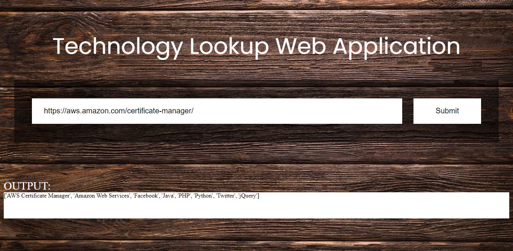
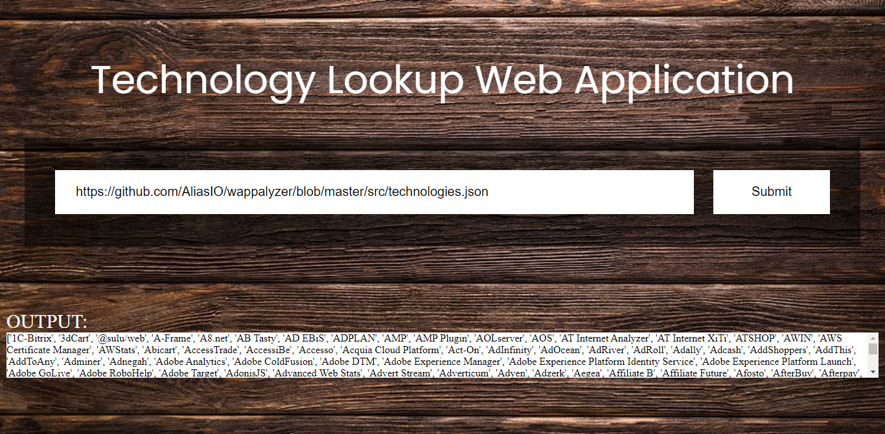
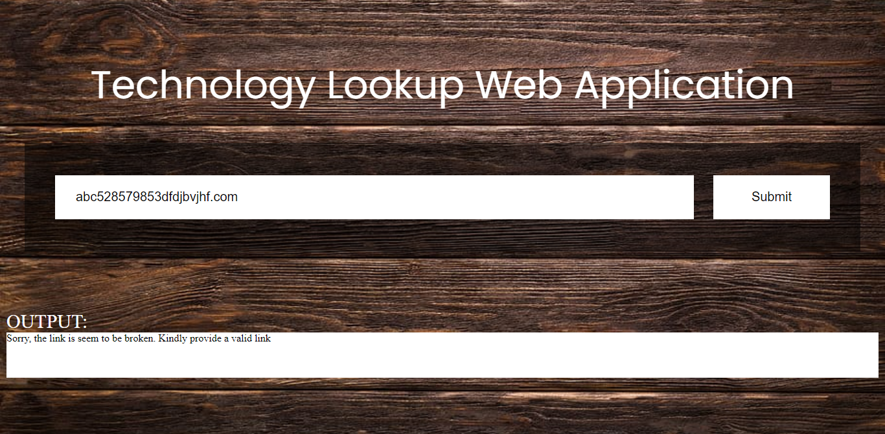

<h1 align="center">Technology Lookup Web Application</h1>

<i>You'll get to know what all technologies a webpage is using.</i>

  

 

<i>Want to connect? See you at <a href="https://www.linkedin.com/in/sahilrahman/">LinkedIn</a></i>

 
This repo aims to find all the technologies that a specific website is using.

  
<h2 style="display: inline-block">Contents</h2>

  <ol>
    <li>
      <a href="#about-the-project">About The Project</a>
      <ul>
        <li><a href="#built-with">Built With</a></li>
      </ul>
    </li>
    <li>
      <a href="#getting-started">Getting Started</a>
      <ul>
        <li><a href="#installation">Installation</a></li>
      </ul>
    </li>
    <li><a href="#contact">Contact</a></li>
  </ol>

## About The Project

This project uses the provided JSON file and converts it into a . CSV file using pandas read_json() function. To identify whether any technologies among the given data, is used by any specific website or not, we use the Technology name and Technology website to differentiate. To develop the frontend, HTML & CSS has been used. Flask, a Python micro web framework, is used to build up the web-applications. The user has to input the URL of any website on to the input field and click on the "Submit" button; it will show all the website's technologies, under the output section.

### Built With

* Python
* Pandas
* BeautifulSoup
* Requests
* Flask
* WTForms

## Website

Link : https://awesome-github-readme-profile.netlify.app

## :man_astronaut: Show your support

Give a ⭐️ if this project helped you!
